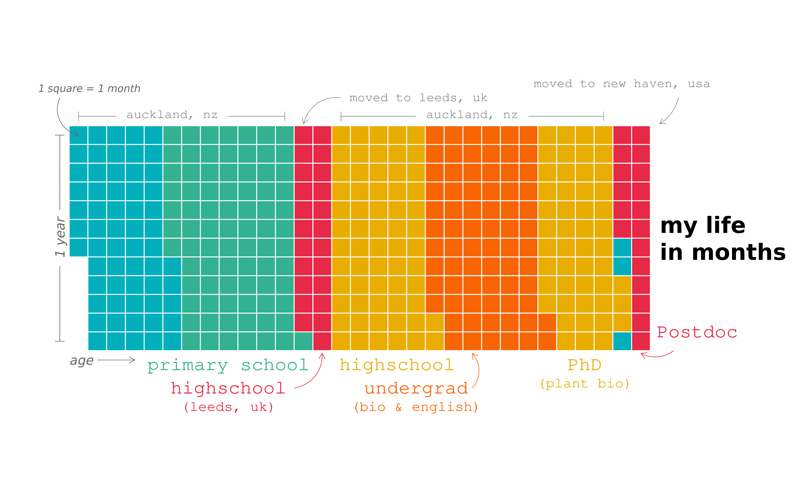

### Hi there 👋

I am a Postdoctoral Associate in the Jacob Lab at Yale University. I am interested in understanding the molecular underpinnings of 🌱 development and how they can be manipulated for beneficial ends. My current work involves developing new tools for 🌱 genome engineering, mainly in *Arabidopsis thaliana* but I also think about *Citrus* species.

I am also interested in reproducible research practices, R programming and data science.

Check out https://g-thomson.com/ for more info

Here is a timeline of my life:

inspired by [@isabellabenabaye](https://github.com/isabellabenabaye/life-chart) and [@sharlagelfand](https://github.com/sharlagelfand/mylifeinmonths/blob/main/README.md) 